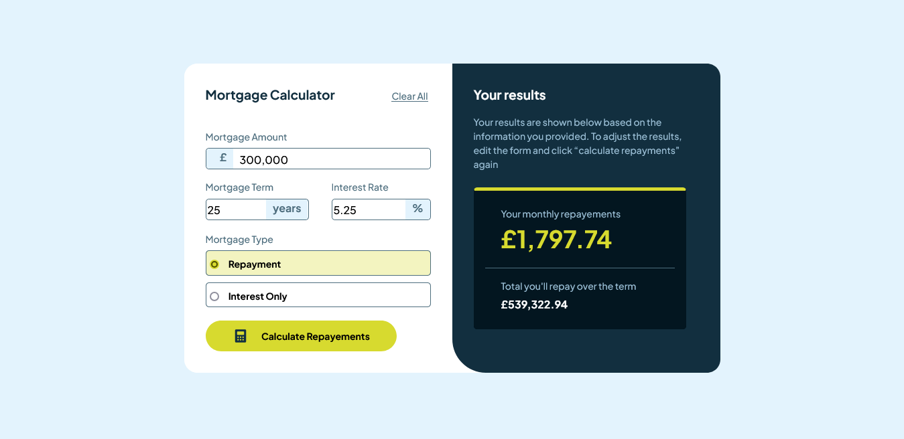

# Frontend Mentor - Mortgage repayment calculator solution

This is a solution to the [Mortgage repayment calculator challenge on Frontend Mentor](https://www.frontendmentor.io/challenges/mortgage-repayment-calculator-Galx1LXK73). Frontend Mentor challenges help you improve your coding skills by building realistic projects.

## Table of contents

-   [Overview](#overview)
    -   [The challenge](#the-challenge)
    -   [Screenshot](#screenshot)
    -   [Links](#links)
-   [My process](#my-process)
    -   [Built with](#built-with)
    -   [What I learned](#what-i-learned)
    -   [Continued development](#continued-development)
-   [Author](#author)

## Overview

### The challenge

Users should be able to:

-   Input mortgage information and see monthly repayment and total repayment amounts after submitting the form
-   See form validation messages if any field is incomplete
-   Complete the form only using their keyboard
-   View the optimal layout for the interface depending on their device's screen size
-   See hover and focus states for all interactive elements on the page

### Screenshot

### Links

-   Solution URL: [Add solution URL here](https://your-solution-url.com)
-   Live Site URL: [Add live site URL here](https://your-live-site-url.com)

## My process

### Built with

-   Semantic HTML5 markup
-   CSS custom properties
-   Flexbox
-   Vanilla Javascript

### What I learned

-How to add a fixed text at the start, inside on an input ($, £, etc.)
-Working with forms and collecting users' data

### Continued development

Still not proficient enough to make my code cleaner, I'm gonna dig into that for future projects

## Author

-   Frontend Mentor - [@Joliot-TSIMISARAKA](https://www.frontendmentor.io/profile/Joliot-TSIMISARAKA)
-   Twitter - [@JoliotSitraka](https://x.com/JoliotSitraka)
